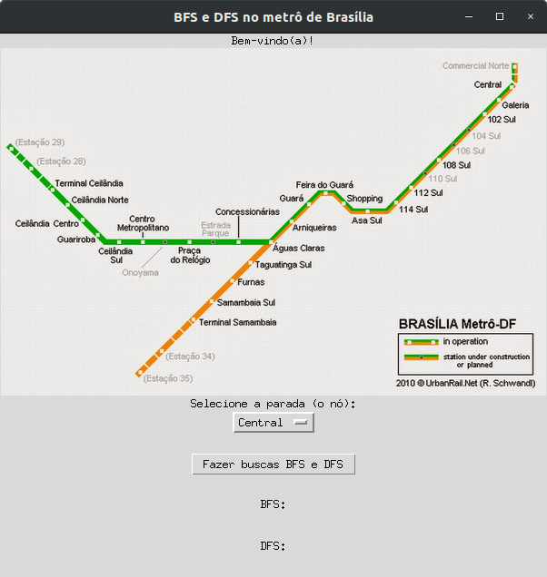
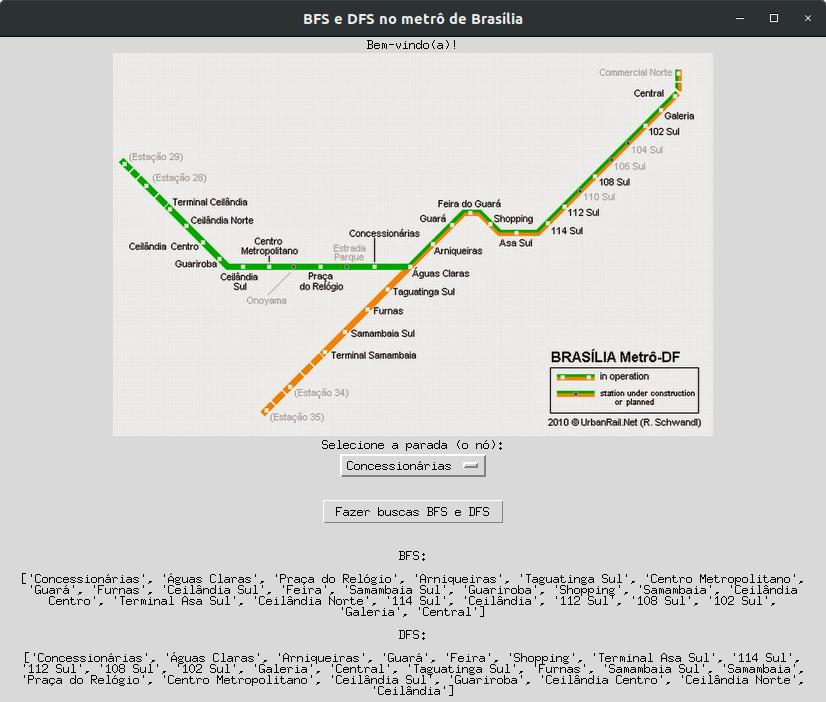
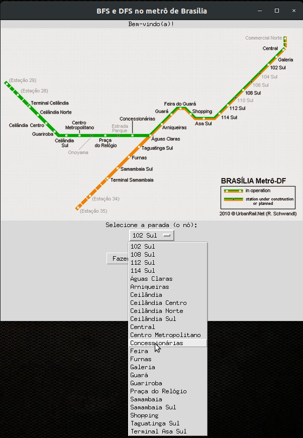

# Metrô BSB

**Número da Lista**: 1 <br>
**Conteúdo da Disciplina**: Grafos 1 <br>

## Alunos
|Matrícula | Aluno |
| -- | -- |
| 16/0144132  |  Rodrigo Fernandes |
| 18/0022962  |  Luís Guilherme G. Lins |

## Sobre 
&nbsp;&nbsp;&nbsp;&nbsp; Apesar da simplicidade do sistema metroviário de Brasília, os mapas nunca deixaram de ser essenciais para o planejamento da rota de um usuário. Diante da realidade de um passageiro identificar onde está e para onde vai, mediante o sistema de metrô de Brasília, e os conhecimentos na área do estudo e busca em grafos, este aplicativo tem como objetivo determinar, a partir dos métodos BFS (Breadth-First Search) e DFS (Depth-First Search), quais estações são alcançáveis a partir de um determinado ponto de início.

## Screenshots
  

## Requisitos
Para a execução do programa, se faz necessária a instalação dos seguintes componentes via terminal:
* python3-pil
* python3-pil.imagetk

A instalação pode ser realizada com o seguinte comando: <br>
```sudo apt-get install python3-pil python3-pil.imagetk```

## Instalação 
**Linguagem**: Python 3.X
Para a instalação serão necessários:
* Git
* Ambiente capaz de interpretar Python 3.X

### Linux
No terminal, escolha o local no qual a pasta será instalada e execute:
1. ```git clone https://github.com/projeto-de-algoritmos/Grafos1_Metro-BSB.git```
2. ```cd Grafos1_Metro-BSB```

Ou

1. Faça o download do projeto zipado a partir do GitHub
2. Descompacte a pasta no destino _path_ escolhido
3. Utilizado o terminal, acesse o local onde a pasta foi descompactada
4. ```cd path/Grafos1_Metro-BSB```

## Uso 
1. No diretório do projeto, execute, com Python 3.X, o arquivo de extensão .py com o comando: <br>
```python3 Metro-BSB.py```
2. Se a instalação foi bem sucedida, a seguinte janela foi aberta: <br>
 <br>
3. Tendo a imagem do sistema metroviário de Brasília como referência visual, escolha a estação/parada da qual se deseja iniciar as buscas no grafo. <br>
 <br>
4. Clique na caixa "Fazer Buscas BFS e DFS" para executar os algortimos, os quais retornarão a ordem na qual as estações foram visitadas pelos respectivos algoritmos <br>
 <br>
5. O passo 4 deve ser repetido caso a estação inicial seja alterada.


